<a id="readme-top"></a>

<div align="center">
  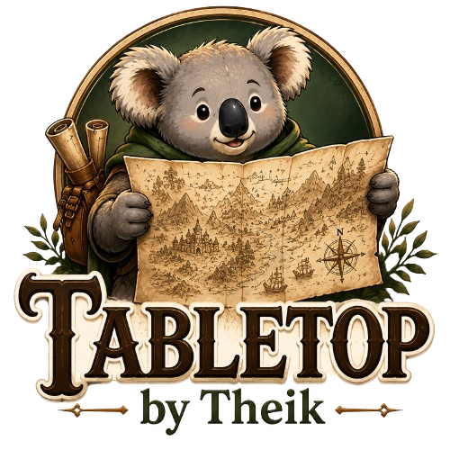

  <h1>Tabletop by Theik - Harrowstone</h1>

  <p>
    <strong>Return to the burned ruins of Harrowstone.</strong><br>
    A 67 × 65 multilevel map for Foundry Virtual Tabletop with four main floors and the oubliette below.
  </p>

  <p>
    <a href="https://github.com/Theik/theiks-harrowstone/releases/latest"></a>
    <a href="https://foundryvtt.com/"></a>
    <a href="https://github.com/Theik/theiks-harrowstone/releases"></a>
    <a href="https://github.com/Theik/theiks-harrowstone/issues"></a>
    <a href="https://www.patreon.com/cw/TabletopByTheik"></a>
  </p>

  <p>
    <a href="#the-map">The map</a>
    ·
    <a href="#map-snapshots">Snapshots</a>
    ·
    <a href="#built-in-interactions">Built-in interactions</a>
    ·
    <a href="#required-renderer">Required renderer</a>
    ·
    <a href="#theiks-toolbag">Toolbag</a>
    ·
    <a href="#installation">Installation</a>
  </p>
</div>

> [!IMPORTANT]
> Harrowstone requires [Theik's KTX2 Renderer](https://github.com/Theik/theiks-ktx2-renderer) and is built for **Foundry Virtual Tabletop v14**. The renderer loads the map's tiled KTX2 artwork at the correct floor and zoom level.

## The map

Harrowstone burned down in 4461 AR during an attempted prisoner escape. The ruined prison is haunted now.

| | |
|:--|:--|
| Scene size | 67 × 65 grid squares |
| Main floors | Ground Floor, First Floor, Roof, and Basement |
| Hidden depth | The oubliette forms a fifth mapped area below the prison |

The packaged Scene has its Levels, walls, lighting, doors, stairs, and interactive map elements set up for play.

## Map snapshots

<p align="center">
  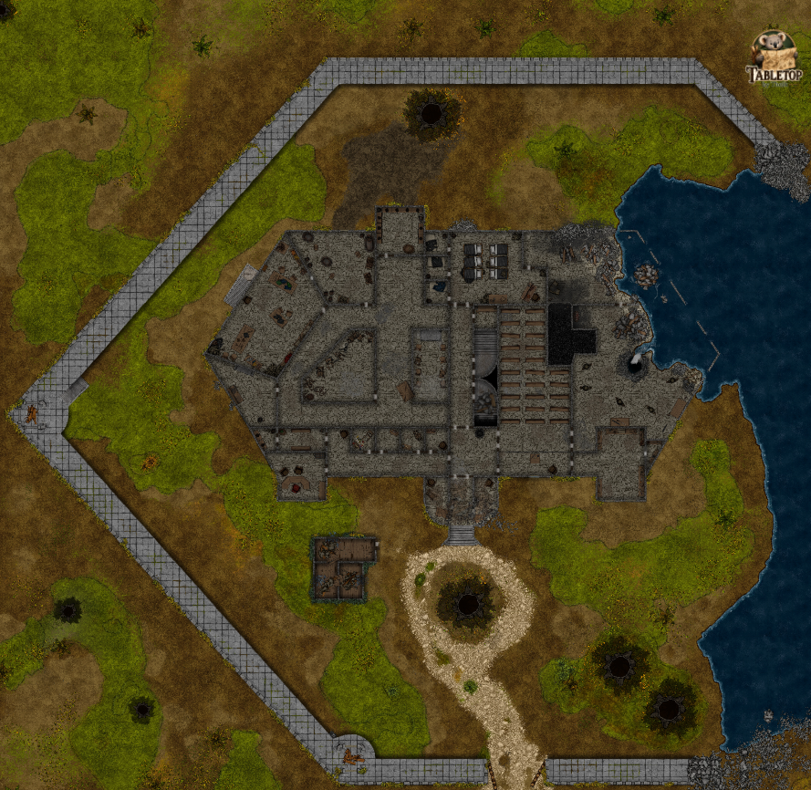
  <br>
  <sub>Ground Floor</sub>
</p>

<table>
  <tr>
    <td width="50%" align="center">
      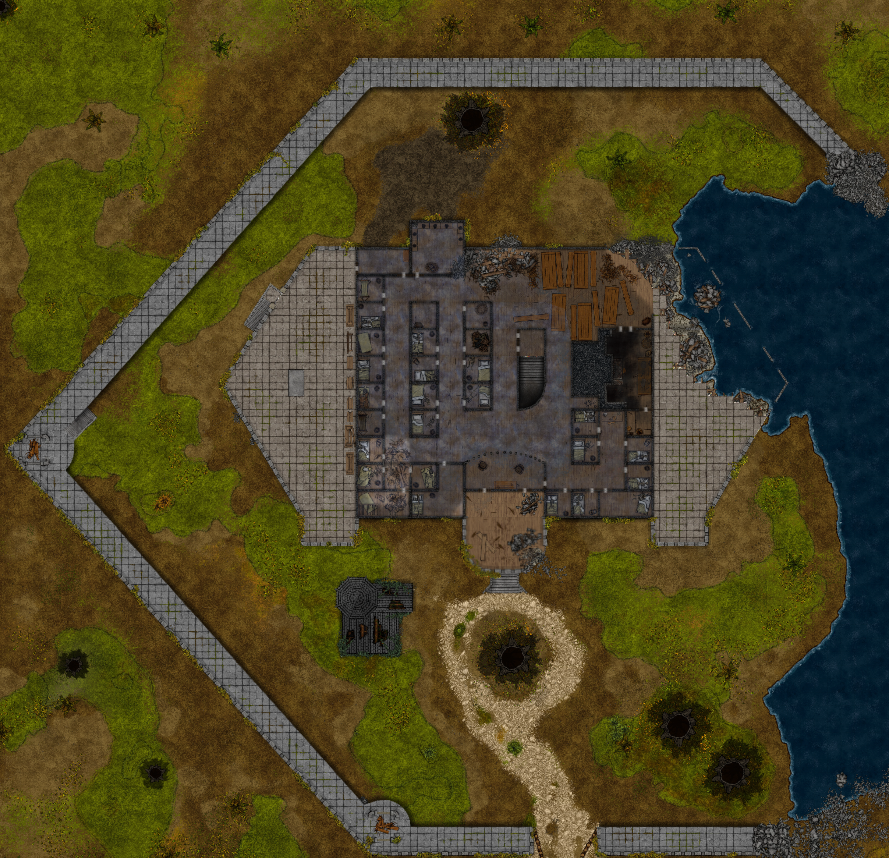
      <br><sub>First Floor</sub>
    </td>
    <td width="50%" align="center">
      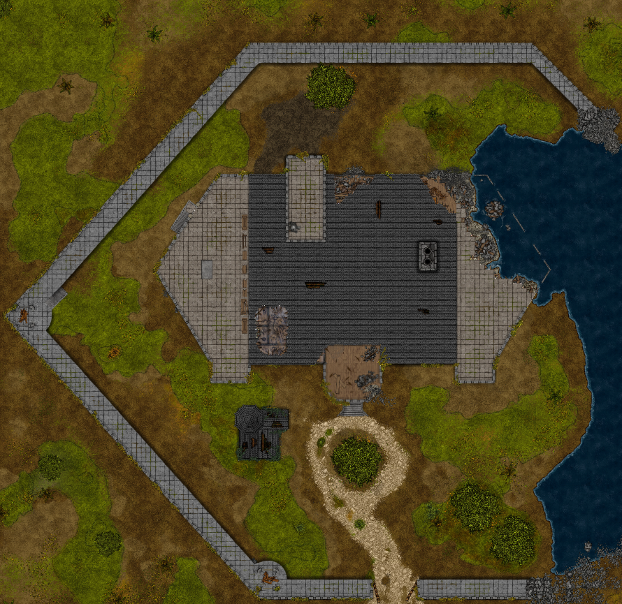
      <br><sub>Roof</sub>
    </td>
  </tr>
</table>

<p align="center">
  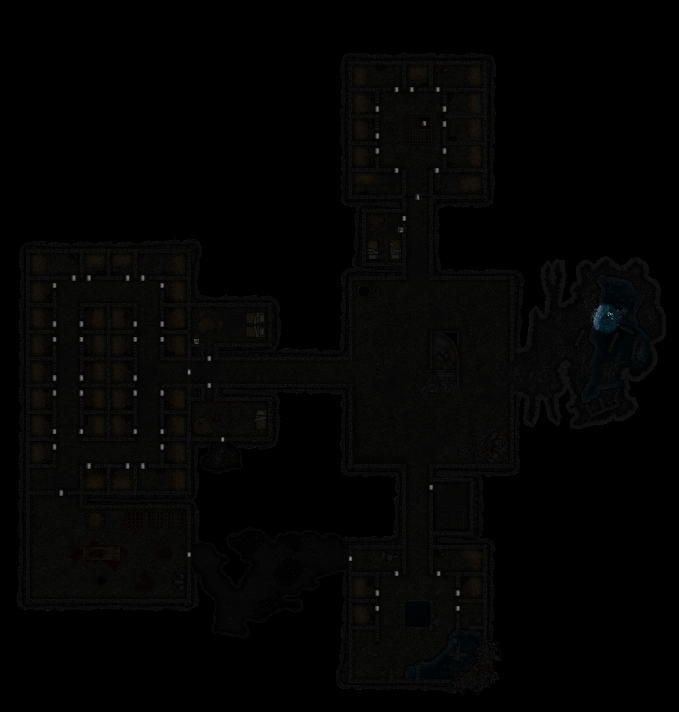
  <br>
  <sub>Basement</sub>
</p>

### Inside the ruins

<table>
  <tr>
    <td width="50%" align="center">
      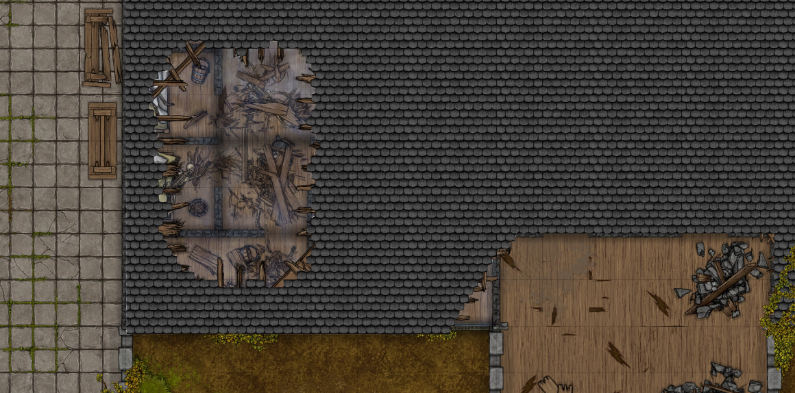
      <br><sub>Collapsed roof</sub>
    </td>
    <td width="50%" align="center">
      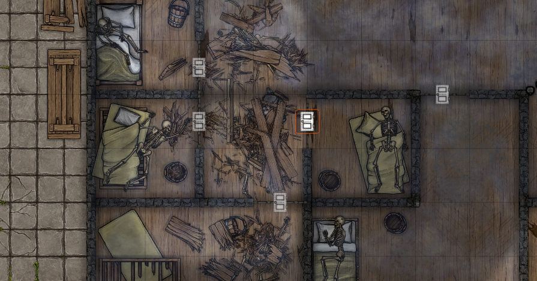
      <br><sub>Haunted cells</sub>
    </td>
  </tr>
  <tr>
    <td width="50%" align="center">
      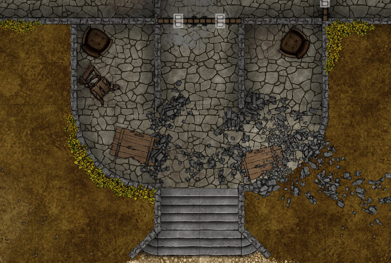
      <br><sub>Breached walls</sub>
    </td>
    <td width="50%" align="center">
      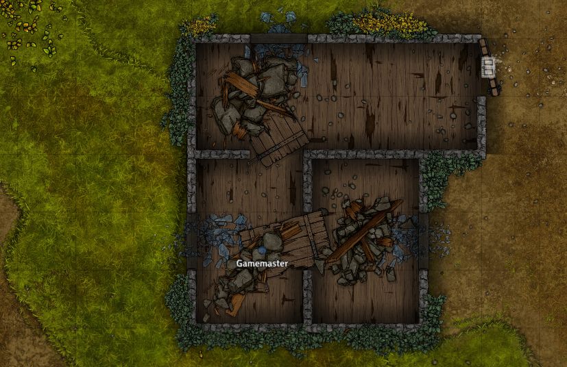
      <br><sub>Ruined outbuilding</sub>
    </td>
  </tr>
  <tr>
    <td width="50%" align="center">
      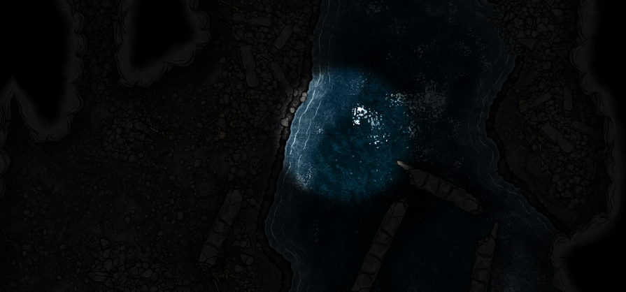
      <br><sub>Below the prison</sub>
    </td>
    <td width="50%" align="center">
      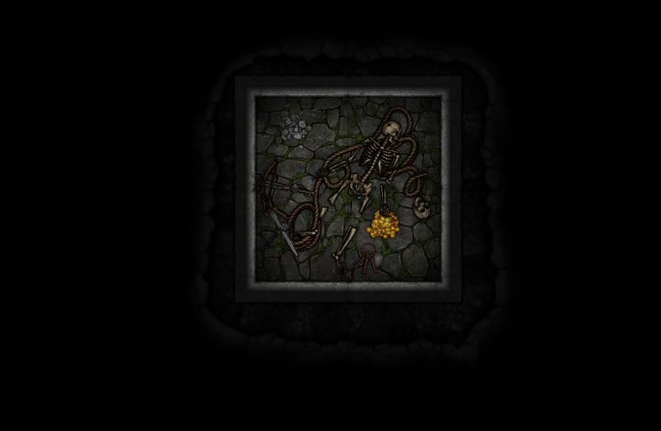
      <br><sub>No one leaves the oubliette unchanged</sub>
    </td>
  </tr>
</table>

## Required renderer

Harrowstone stores every floor as a multi-resolution KTX2 tile pyramid instead of one very large background image. [Theik's KTX2 Renderer](https://github.com/Theik/theiks-ktx2-renderer) selects the current floor and streams the tiles needed for the visible part of the Scene. It also swaps image density as you zoom. Without the renderer, Foundry cannot display the packaged map backgrounds correctly.

Install the renderer using its manifest URL:

```text
https://github.com/Theik/theiks-ktx2-renderer/releases/latest/download/module.json
```

## Built-in interactions

Animated doors and secret doors are included with Harrowstone. They work without Theik's Toolbag.

<table>
  <tr>
    <td width="50%" align="center">
      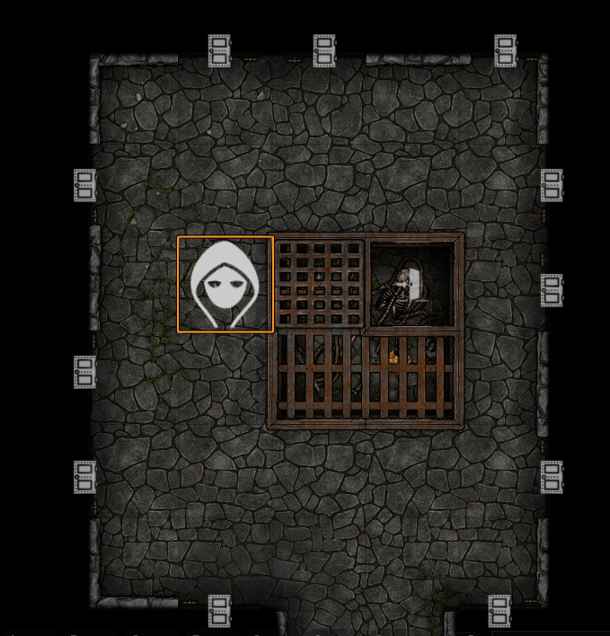
      <br><sub>Animated doors</sub>
    </td>
    <td width="50%" align="center">
      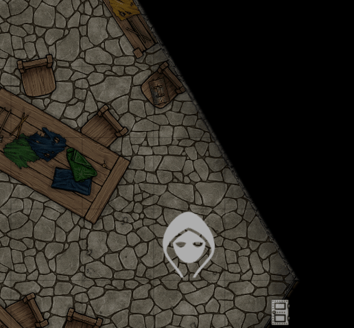
      <br><sub>Secret doors</sub>
    </td>
  </tr>
</table>

Toolbag only activates the prepared destroyable terrain, stairs, and levers described below.

## Theik's Toolbag

[Theik's Toolbag](https://github.com/Theik/theiks-toolbag) is optional. Harrowstone works without it, but enabling Toolbag activates the Scene's prepared destroyable terrain, working stairs, and usable levers.

The interactions below require Toolbag.

<table>
  <tr>
    <td width="50%" align="center">
      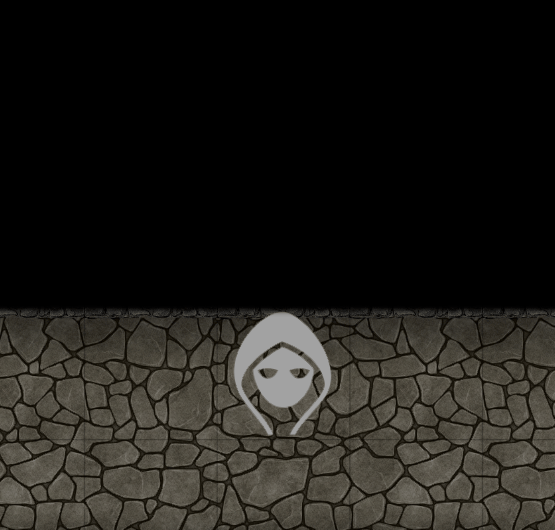
      <br><sub>Breakable walls</sub>
    </td>
    <td width="50%" align="center">
      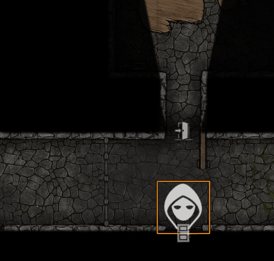
      <br><sub>Interactable portcullises</sub>
    </td>
  </tr>
  <tr>
    <td width="50%" align="center">
      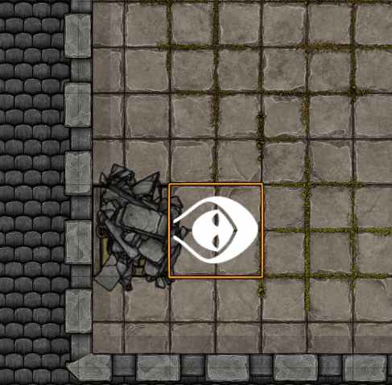
      <br><sub>Working trapdoors</sub>
    </td>
    <td width="50%" align="center">
      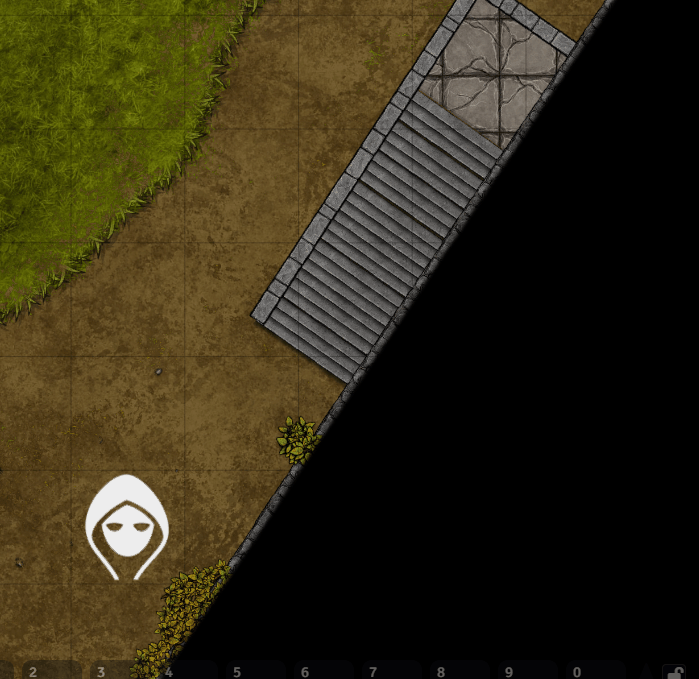
      <br><sub>Stair and Scene transitions</sub>
    </td>
  </tr>
  <tr>
    <td colspan="2" align="center">
      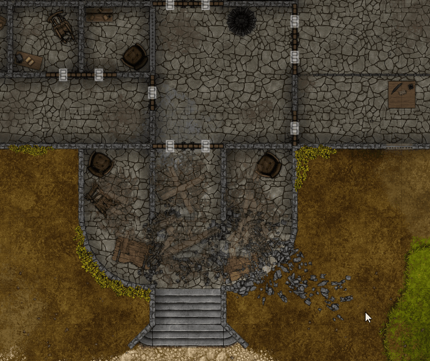
      <br><sub>Collapsing balcony</sub>
    </td>
  </tr>
</table>

Install Toolbag using its manifest URL:

```text
https://github.com/Theik/theiks-toolbag/releases/latest/download/module.json
```

## Installation

### Release installation

1. In Foundry, open **Add-on Modules → Install Module**.
2. Install [Theik's KTX2 Renderer](https://github.com/Theik/theiks-ktx2-renderer/releases/latest/download/module.json).
3. Paste the Harrowstone manifest URL below into **Manifest URL** and select **Install**.
4. Enable **Tabletop by Theik - Harrowstone** and **Theik's KTX2 Renderer** from **Manage Modules** in your world.
5. Open **Compendium Packs**, find **Shared Maps**, and import the **Harrowstone** Scene.

```text
https://github.com/Theik/theiks-harrowstone/releases/latest/download/module.json
```

Install [Theik's Toolbag](https://github.com/Theik/theiks-toolbag/releases/latest/download/module.json) as well if you want the interactive terrain, stairs, and levers.

## License, credits, and legal

<div>
  <p>
    <strong>Code:</strong> Original module code and documentation are released under the <a href="LICENSE">MIT License</a>.
  </p>
  <p>
    <strong>Cartography:</strong> The map was created with <a href="https://dungeondraft.net/">Dungeondraft</a> by Megasploot.<br>
    <strong>Artwork:</strong> The map was created using assets from <a href="https://www.forgotten-adventures.net/">Forgotten Adventures</a>.
  </p>
</div>

The MIT License does **not** cover bundled assets, map artwork, or compendium content containing third-party material. Those materials remain subject to their owner's terms. See [Third-Party Notices](THIRD_PARTY_NOTICES.md) for the attribution and license-scope details.

Dungeondraft, Forgotten Adventures, and related names, assets, and marks belong to their respective owners. This project is not affiliated with or endorsed by Megasploot, Tailwind Games, LLC, or Forgotten Adventures.

---

<div align="center">
  

  <p><strong>Built by <a href="https://github.com/Theik">Theik</a> for adventurous tables.</strong></p>
  <p>
    <a href="https://github.com/Theik/theiks-harrowstone/releases">Releases</a>
    ·
    <a href="https://github.com/Theik/theiks-harrowstone/issues">Report an issue</a>
    ·
    <a href="https://www.patreon.com/cw/TabletopByTheik">Support on Patreon</a>
    ·
    <a href="#readme-top">Back to top ↑</a>
  </p>
</div>
